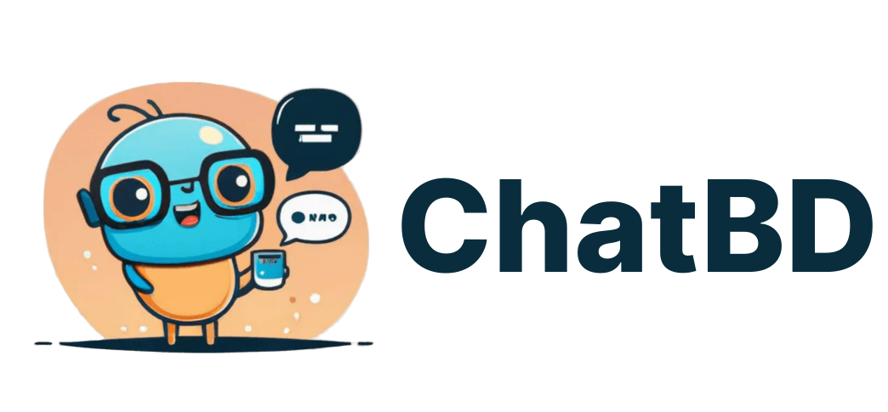

# ChatBD

ChatGPT For Your Own Business Data



## Docker & Docker Compose

Deploying ChatDB with Docker and Docker Compose is as easy as it can get.

## Installing Docker and Docker Compose

If you don't have it already, make sure you have Docker and Docker-compose (v2 is required) installed and operational. To quickly do that you can use Docker's official helper script

```bash
    curl -L https://get.docker.com | sh
```

Add the current user to the docker group and reboot in order to run docker without using sudo by executing.

```bash
    sudo usermod -aG docker $USER
    sudo reboot
```

## Fetching project

Navigate to any directory of your choice and clone ChatBD project

```bash
    git clone https://github.com/Magic-AI-Lab/Docker.git chatbd
```

## Editing Variables

Environment variables are set using a .env file. You can just rename the example file by

```bash
    cp env.example .env
```

Next, start up the container by executing:

```bash
    docker compose -f compose.yml up -d
```

This is going to:

1. Start middleware services (PGVector, Redis, Elasticsearch, Kafka, ...).
2. Start ChatBD apps, that will also wait for middleware service to be ready.

## Updating ChatBD Docker Image

To update the ChatBD docker image to the latest version, update the TAG value in your .env file, then simply run:

```bash
    docker compose -f compose.yml up -d
```